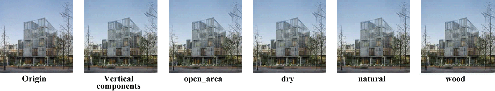

# Architectural Design Image dYeing (ArchiDIY) [FROM EXPLORATION TO INTERPRETATION](https://caadria2021.org/wp-content/uploads/2021/03/caadria2021_038.pdf)
> This is the official repo for the paper: [FROM EXPLORATION TO INTERPRETATION:Adopting Deep Representation Learning Models to Latent Space Interpretation of Architectural Design Alternatives](https://caadria2021.org/wp-content/uploads/2021/03/caadria2021_038.pdf), which offers a framework for editing architectural design images.



# Citation
If you find the code in our research useful, please consider cite:
```
@inproceedings{chen_exploration_2021,
	title = {From Exploration to Interpretation-Adopting Deep Representation Learning Models to Latent Space Interpretation of Architectural Design Alternatives},
	volume = {1},
	eventtitle = {{CAADRIA}},
	pages = {131--140},
	booktitle = {{PROJECTIONS}, Proceedings of the 26th International Conference of the Association for Computer-Aided Architectural Design Research in Asia},
	author = {Chen, Jielin and Stouffs, Rudi},
	date = {2021},
	note = {Publisher: {CUMINCAD}},
}
```

# Acknowledgments
Part of the code is inspired by <a href="https://github.com/NVlabs/stylegan2">NVlabs/stylegan2</a>, <a href="https://github.com/genforce/higan">genforce/higan</a> and <a href="https://github.com/genforce/interfacegan">genforce/interfacegan</a>.
